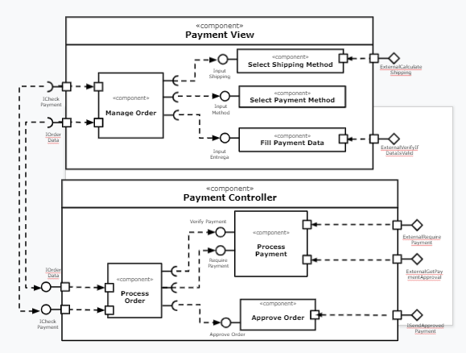

# Projeto `marketplace`
# Equipe 6

Integrantes

- Altieres S. Netto (RA: ex150315)
- Byron Acuña ()
- Gustavo Gini ()
- Juliana Malton ()
- Sophia Lancini ()

# Nível 1

> Detalhamento do nível 1

## Diagrama Geral do Nível 1

> Diagramas descritivos da visão geral do sistema

### Detalhamento da interação de componentes

#### Processo de compra
- O componente Cliente faz o pedido de compra pela interface PlaceOrder enviando os dados da compra Order
- O componente Serviço de Processamento de Compra recebe Order pela interface GetOrder
- O Serviço de Processamento de Compra por sua vez envia uma mensagem contendo PackageInfo pela interface RequestPackage
- O componente Loja recebe essa mensagem pela interface GetPackageRequest

#### Processo de lançamento e distribuição de ofertas
- O componente Loja envia suas ofertas para o tópico offer através da interface PlaceOffer.
- O Serviço de Distribuição de Ofertas por sua vez recebe essas ofertas com a interface GetOffers.

- O processo de compra inicia através do componente SHOPPER que cria um pedido através da interface IOrderCreate.
- O componente ORDER recebe o pedido, ele cria um novo pedido e posta através da interface ICheckPayment no tópico /payment/order/<orderId>/approved caso a compra tenha sido aprovada ou no tópico /payment/order/<orderId>/denied. 
- No caso da compra aprovada o loja, componente SHOP, posta uma mensagem para envio da mercadoria para o componente Shipping 
- Os componentes SHOP publicam no barramento as mensagens de tópico “offer/<offer_id>/place” através da interface ISendOffers.
- O componente RECOMENDATION assina o barramento as mensagens de tópico “offer/<offer_id>/place” através da interface IPlaceOffers.
- O componente RECOMENDATION assina o barramento as mensagens de tópico “recommendations/<rcm_type>/get” através da interface IGetRanks.
- O componente RECOMENDATION publica no barramento as mensagens de tópico “recommendations/<rcm_type>/get” através da interface ISendRecommendation.
- O componente SHOPPER publica no barramento as mensagens de tópico “ranks/<rnk_type>/send” através da interface IRanks.
- O componente SHOPPER assina o barramento as mensagens de tópico “recommendation/<rcm_type>/get” através da interface IRecommendations.
- O componente SHOPPER assina o barramento as mensagens de tópico “ship/<order_id>/<order_status>/track” através da interface IFetchShippedOrdes.
- O componente SHOP assina o barramento as mensagens de tópico “payment/<order_id>/<status>/send” através da interface IGetApprovedPayment.
- Os componentes SHOP publica no barramento as mensagens de tópico “ship/<order_id>/<order_status>/update” através da interface ISendToShips.
- O componente SHIPPING assina o barramento as mensagens de tópico “ship/<order_id>/<order_status>/update” através da interface IShipOrder.
- O componente SHIPPING publica no barramento as mensagens de tópico “ship/<order_id>/<order_status>/track” através da interface IShippingOrder.
- O componente PAYMENT assina o barramento as mensagens de tópico “payment/<order_id>/verify” através da interface ICheckPayment.
- O componente PAYMENT publica no barramento as mensagens de tópico “payment/<order_id>/<status>/send” através da interface ISendApprovedPayment.
- O componente ORDER publica no barramento as mensagens de tópico “payment/<order_id>/<status>/send” através da interface IPayment.
- O componente ORDER solicita a ordem criada diretamente ao componente SHOPPER através da interface IRetrieveOrder.

**Interfaces**
> Listagem das interfaces do componente.

As interfaces listadas são detalhadas a seguir:

## Detalhamento das Interfaces

### Interface `PlaceOffers`

> Interface que permite enviar as ofertas, em reação a uma requisição de preços 

> Dados da interface:

* Type: `source`
* Topic: `offer/<offer_id>/place`
* Message type: `Offer`

> Detalhamento da mensagem `Offer` em formato JSON

~~~json
{
  store: {
    storeId: string,
    location: {
      country: string,
      state: string,
      city: string,
      address: string,
      cep: string
  	}
  },
  product: {
    productId: string,
    quantityAvailable: number,
    unitaryPrice: number,
    availableQuantity: number,
  }
}
~~~
### Interface `GetOffer`

> Interface que permite receber as ofertas, em reação a uma requisição de preços

> Dados da interface:

* Type: `sink`
* Topic: `offer/<offer_id>/get`
* Message type: `Offer`

> Detalhamento da mensagem `Offer` em formato JSON

~~~json
{
  store: {
    storeId: string,
    location: {
      country: string,
      state: string,
      city: string,
      address: string,
      cep: string
  	}
  },
  product: {
    productId: string,
    quantityAvailable: number,
    unitaryPrice: number,
    availableQuantity: number,
  }
}
~~~

### Interface `PlaceOrder`

> Interface que permite inserir um pedido no barramento, iniciando o processo de leilão

> Dados da interface:

* Type: `source`
* Topic: `order/<order_id>/place`
* Message type: `Order`

> Detalhamento da mensagem `Order` em formato JSON

~~~json
{
  orderId: string,
  orderDate: data,
  total: number,
  shippingCost: number,
  items: [
	{
   	  itemid: string,
   	  quantity: number,
  price: number
	}
  ],
  buyerUserId: string,
  shippingAddress: {
    address: string,
    city: string,
    state: string,
    country: string,
    cep: string
  } 
}
~~~
### Interface `GetOrder`

> Interface que permite receber o pedido no barramento, iniciando o processo de leilão

> Dados da interface:

* Type: `sink`
* Topic: `order/<order_id>/get`
* Message type: `Order`

> Detalhamento da mensagem `Order` em formato JSON

~~~json
{
  orderId: string,
  orderDate: data,
  total: number,
  shippingCost: number,
  items: [
	{
   	  itemid: string,
   	  quantity: number,
      price: number
	}
  ],
  buyerUserId: string,
  shippingAddress: {
    address: string,
    city: string,
    state: string,
    country: string,
    cep: string
  } 
}
~~~

### Interface `SendBestOffers`

> Interface que permite enviar as melhores ofertas, disponibilizando as melhores ofertas de um determinado produto ou tipo de produto para o usuário

> Dados da interface:

* Type: `source`
* Topic: `best-offers/<offer_id>/send`
* Message type: `BestOffers`

> Detalhamento da mensagem `BestOffers` em formato JSON

~~~json
{
  items: [
    {
		itemid: string,
		offerType: string,
        offer: Offer
	}
  ]
}
~~~
### Interface `GetBestOffers`

> Interface que permite receber as melhores ofertas pelo usuário

> Dados da interface:

* Type: `sink`
* Topic: `best-offers/<offer_id>/get`
* Message type: `BestOffers`

> Detalhamento da mensagem `BestOffers` em formato JSON

~~~json
{
  items: [
    {
		itemid: string,
		offerType: string,
    	offer: Offer
	}
  ]
}
~~~

### Interface `RequestPackage`

> Interface que permite requisitar o envio do pacote de um dado pedido

> Dados da interface:

* Type: `source`
* Topic: `package/<order_id>/request`
* Message type: `PackageInfo`

> Detalhamento da mensagem `PackageInfo` em formato JSON

~~~json
{
  orderId: string,
  total: number,
  items: [
	{
   	  itemid: string,
   	  quantity: number,
      price: number
	}
  ],
  postCode: string,
  shippingAddress: {
	recipient: string,
    address: string,
    city: string,
    state: string,
    country: string,
    cep: string
  } 
}
~~~
### Interface `GetRequestPackage`

> Interface que permite obter as informações do frete do pedido efetuado

> Dados da interface:

* Type: `sink`
* Topic: `package/<order_id>/get`
* Message type: `PackageInfo`

> Detalhamento da mensagem `PackageInfo` em formato JSON

~~~json
{
  orderId: string,
  total: number,
  items: [
	{
   	  itemid: string,
   	  quantity: number,
      price: number
	}
  ],
  postCode: string,
  shippingAddress: {
	recipient: string,
    address: string,
    city: string,
    state: string,
    country: string,
    cep: string
  } 
}
~~~

### Interface `Recommendations`

> Interface que permite obter recomendações de compra de um determinado tipo (ex: melhor preço, frete mais rápido, melhor vendedor, etc)

> Dados da interface:

* Type: `sink`
* Topic: `recommendation/<rcm_type>/get`
* Message type: `Recommendation`

> Detalhamento da mensagem `Recommendation` em formato JSON

~~~json
{
  rcm_type: string,
  total: number,
  items: [
	{
   	  itemid: string,
   	  quantity: number,
      price: number
	}
  ]
}
~~~
### Interface `Ranks`

> Interface que elenca os melhores tipos de ofertas por um dado tipo

> Dados da interface:

* Type: `source`
* Topic: `ranks/<rnk_type>/send`
* Message type: `Ranks`

> Detalhamento da mensagem `Ranks` em formato JSON

~~~json
{
  rnk_type: string,
  total: number,
  items: [
	{
   	  itemid: string,
   	  quantity: number,
      price: number
	}
  ]
}
~~~

### Interface `CheckPayment`

> Verifica os dados de pagamento de um dado pedido

> Dados da interface:

* Type: `sink`
* Topic: `payment/<order_id>/verify`
* Message type: `Payment`

> Detalhamento da mensagem `Payment` em formato JSON

~~~json
{
  order_id: number,
  order_status: boolean,
  payment_id: string,
  payment_type: string,
  total_value: decimal(2),
  updated_at: datetime,
  created_at: datetime
}
~~~
### Interface `SendApprovedPayment`

> Envia a confirmação de pagamento de um dado pedido, com informações relevantes acerca do mesmo.

> Dados da interface:

* Type: `source`
* Topic: `payment/<order_id>/<status>/send`
* Message type: `Payment`

> Detalhamento da mensagem `Payment` em formato JSON

~~~json
{
  order_id: number,
  order_status: boolean,
  payment_id: string,
  payment_type: string,
  total_value: decimal(2),
  updated_at: datetime,
  created_at: datetime
}
~~~

### Interface `ShippedOrder`

> Interface que reúne informações do envio do pacote do pedido.

> Dados da interface:

* Type: `sink`
* Topic: `ship/<order_id>/<order_status>/track`
* Message type: `Ship`

> Detalhamento da mensagem `Ship` em formato JSON

~~~json
{
  order_id: number,
  order_status: string,
  shipping_method: string,
  total_value: decimal(2),
  items: [
	{
   	  itemid: string,
   	  quantity: number,
      price: number
	}
  ]
}
~~~
### Interface `ShipOrder`

> Interface que aciona o processo de envio do pedido realizado

> Dados da interface:

* Type: `source`
* Topic: `ship/<order_id>/<order_status>/update`
* Message type: `Ship`

> Detalhamento da mensagem `Ship` em formato JSON

~~~json
{
  order_id: number,
  order_status: string,
  shipping_method: string,
  total_value: decimal(2),
  items: [
	{
   	  itemid: string,
   	  quantity: number,
      price: number
	}
  ]
}
~~~

# Nível 2

> Apresente aqui o detalhamento do Nível 2 conforme detalhado na especificação com, no mínimo, as seguintes subseções:

## Diagrama do Nível 2

> Apresente um diagrama conforme o modelo a seguir:

> 

### Detalhamento da interação de componentes

> O detalhamento deve seguir um formato de acordo com o exemplo a seguir:

- O componente PAYMENT assina o barramento mensagens de tópico “payment/<order_id>/verify”, através da interface ICheckPayment e dispara o gerenciamento do pagamento.
- Internamento o evento é atendido pelo componente Manage Order, que possui a responsabilidade requisitar informações de outras interfaces.
- O componente ManageOrder solicita o método de envio do componente Select Shipping Method através da interface Input Shipping.
- O componente ManageOrder solicita o método de pagamento do componente Select Payment Method através da interface Input Method.
- O componente ManageOrder solicita o método de preenchimento de dados do componente Fill Payment Data  através da interface Input Entrega.
- O componente Select Shipping Method assina o barramento mensagens, através da interface ExternalCalculateShipping  e dispara o cálculo do envio.
- O componente Fill Payment Data assina o barramento mensagens, através da interface ExternalVerifyIfDataIsValid  e dispara o cálculo do envio.\
- O componente PAYMENT assina o barramento mensagens de tópico “payment/<order_id>/verify”, através da interface ICheckPayment e dispara o processamento da ordem através do componente Process Order.
- Internamento o evento é atendido pelo componente Process Order, que possui a responsabilidade requisitar informações de outras interfaces.
- O componente Process Order solicita verificação do pagamento do componente Process Payment através da interface Verify Payment.
- O componente Process Order solicita o pagamento do componente Process Payment através da interface Require Payment.
- O componente Process Order solicita aprovação da ordem de pagamento do componente Approve Order através da interface Approve Order.
- O componente Process Payment solicita externamente  aprovação de pagamento e requisição de pagamento através das interfaces ExternalRequirePayment e ExternalGetPaymentApproval.
- O componente Approve Order envia externamente  aprovação de pagamento através da interface ISendApprovedPayment.

### Interface `ITableProducer`

Interface provida por qualquer fonte de dados que os forneça na forma de uma tabela.

Método | Objetivo
-------| --------
`requestAttributes` | Retorna um vetor com o nome de todos os atributos (colunas) da tabela.
`requestInstances` | Retorna uma matriz em que cada linha representa uma instância e cada coluna o valor do respectivo atributo (a ordem dos atributos é a mesma daquela fornecida por `requestAttributes`.

### Interface `IDataSetProperties`

Define o recurso (usualmente o caminho para um arquivo em disco) que é a fonte de dados.

Método | Objetivo
-------| --------
`getDataSource` | Retorna o caminho da fonte de dados.
`setDataSource` | Define o caminho da fonte de dados, informado através do parâmetro `dataSource`.

## Diagrama do Nível 3

> Apresente uma imagem com a captura de tela de seu protótipo feito no MIT App Inventor, conforme modelo a seguir:

> Apresente o diagrama referente ao protótipo conforme o modelo a seguir:

### Detalhamento da interação de componentes

> O detalhamento deve seguir o mesmo formato usado no Nível 2.
