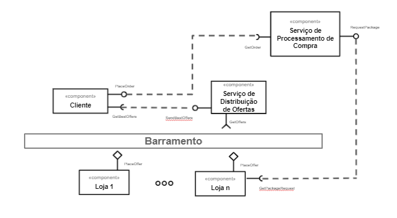
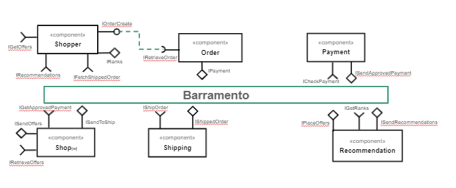

# Projeto `marketplace`
# Equipe 6

Integrantes

- Altieres S. Netto (RA: ex150315)
- Byron Acuña ()
- Gustavo Gini ()
- Juliana Malton ()
- Sophia Lancini ()

# Nível 1

> Apresente aqui o detalhamento do Nível 1 conforme detalhado na especificação com, no mínimo, as seguintes subseções:

## Diagrama Geral do Nível 1

> Diagramas descritivos da visão geral do sistema

### Detalhamento da interação de componentes

#### Processo de compra
- O componente Cliente faz o pedido de compra pela interface PlaceOrder enviando os dados da compra Order
- O componente Serviço de Processamento de Compra recebe Order pela interface GetOrder
- O Serviço de Processamento de Compra por sua vez envia uma mensagem contendo PackageInfo pela interface RequestPackage
- O componente Loja recebe essa mensagem pela interface GetPackageRequest

#### Processo de lançamento e distribuição de ofertas
- O componente Loja envia suas ofertas para o tópico offer através da interface PlaceOffer.
- O Serviço de Distribuição de Ofertas por sua vez recebe essas ofertas com a interface GetOffers.

* O componente `Leilão` inicia o leilão publicando no barramento a mensagem de tópico "`auction/{auctionId}/start`" através da interface `AuctionStart`, iniciando um leilão.
* Os componentes Loja assinam no barramento mensagens de tópico "`auction/+/start`" através da interface `AuctionEngage`. Quando recebe uma mensagem…

> Para cada componente será apresentado um documento conforme o modelo a seguir:

## Componente `<Nome do Componente>`

> Resumo do papel do componente e serviços que ele oferece.

> Diagrama do componente, conforme exemplo a seguir:

**Interfaces**
> Listagem das interfaces do componente.

As interfaces listadas são detalhadas a seguir:

## Detalhamento das Interfaces

### Interface `PlaceOffers`

> Resumo do papel da interface.

> Dados da interface:

* Type: `source`
* Topic: `offer/<offer_id>/place`
* Message type: `Offer`

> Detalhamento da mensagem `Offer` em formato JSON

~~~json
{
  store: {
    storeId: string,
    location: {
      country: string,
      state: string,
      city: string,
      address: string,
      cep: string
  	}
  },
  product: {
    productId: string,
    quantityAvailable: number,
    unitaryPrice: number,
    availableQuantity: number,
  }
}
~~~
### Interface `GetOffer`

> Resumo do papel da interface.

> Dados da interface:

* Type: `sink`
* Topic: `offer/<offer_id>/get`
* Message type: `Offer`

> Detalhamento da mensagem `Offer` em formato JSON

~~~json
{
  store: {
    storeId: string,
    location: {
      country: string,
      state: string,
      city: string,
      address: string,
      cep: string
  	}
  },
  product: {
    productId: string,
    quantityAvailable: number,
    unitaryPrice: number,
    availableQuantity: number,
  }
}
~~~

### Interface `PlaceOrder`

> Resumo do papel da interface.

> Dados da interface:

* Type: `source`
* Topic: `order/<order_id>/place`
* Message type: `Order`

> Detalhamento da mensagem `Order` em formato JSON

~~~json
{
  orderId: string,
  orderDate: data,
  total: number,
  shippingCost: number,
  items: [
	{
   	  itemid: string,
   	  quantity: number,
  price: number
	}
  ],
  buyerUserId: string,
  shippingAddress: {
    address: string,
    city: string,
    state: string,
    country: string,
    cep: string
  } 
}
~~~
### Interface `GetOrder`

> Resumo do papel da interface.

> Dados da interface:

* Type: `sink`
* Topic: `order/<order_id>/get`
* Message type: `Order`

> Detalhamento da mensagem `Order` em formato JSON

~~~json
{
  orderId: string,
  orderDate: data,
  total: number,
  shippingCost: number,
  items: [
	{
   	  itemid: string,
   	  quantity: number,
  price: number
	}
  ],
  buyerUserId: string,
  shippingAddress: {
    address: string,
    city: string,
    state: string,
    country: string,
    cep: string
  } 
}
~~~

### Interface `SendBestOffers`

> Resumo do papel da interface.

> Dados da interface:

* Type: `source`
* Topic: `best-offers/<offer_id>/send`
* Message type: `BestOffers`

> Detalhamento da mensagem `BestOffers` em formato JSON

~~~json
{
  items: [
    {
		itemid: string,
		offerType: string,
    		offer: Offer
	}
  ]
}
~~~
### Interface `GetBestOffers`

> Resumo do papel da interface.

> Dados da interface:

* Type: `sink`
* Topic: `best-offers/<offer_id>/get`
* Message type: `BestOffers`

> Detalhamento da mensagem `BestOffers` em formato JSON

~~~json
{
  items: [
    {
		itemid: string,
		offerType: string,
    		offer: Offer
	}
  ]
}
~~~

### Interface `RequestPackage`

> Resumo do papel da interface.

> Dados da interface:

* Type: `source`
* Topic: `package/<order_id>/request`
* Message type: `PackageInfo`

> Detalhamento da mensagem `PackageInfo` em formato JSON

~~~json
{
  orderId: string,
  total: number,
  items: [
	{
   	  itemid: string,
   	  quantity: number,
  price: number
	}
  ],
  postCode: string,
  shippingAddress: {
	recipient: string,
    address: string,
    city: string,
    state: string,
    country: string,
    cep: string
  } 
}
~~~
### Interface `GetRequestPackage`

> Resumo do papel da interface.

> Dados da interface:

* Type: `sink`
* Topic: `package/<order_id>/get`
* Message type: `PackageInfo`

> Detalhamento da mensagem `PackageInfo` em formato JSON

~~~json
{
  orderId: string,
  total: number,
  items: [
	{
   	  itemid: string,
   	  quantity: number,
  price: number
	}
  ],
  postCode: string,
  shippingAddress: {
	recipient: string,
    address: string,
    city: string,
    state: string,
    country: string,
    cep: string
  } 
}
~~~

### Interface `Recommendations`

> Resumo do papel da interface.

> Dados da interface:

* Type: `sink`
* Topic: `recommendation/<rcm_type>/get`
* Message type: `Recommendation`

> Detalhamento da mensagem `Recommendation` em formato JSON

~~~json
{
  rcm_type: string,
  total: number,
  items: [
	{
   	  itemid: string,
   	  quantity: number,
  price: number
	}
  ]
}
~~~
### Interface `Ranks`

> Resumo do papel da interface.

> Dados da interface:

* Type: `source`
* Topic: `ranks/<rnk_type>/send`
* Message type: `Ranks`

> Detalhamento da mensagem `Ranks` em formato JSON

~~~json
{
  rnk_type: string,
  total: number,
  items: [
	{
   	  itemid: string,
   	  quantity: number,
  price: number
	}
  ]
}
~~~

### Interface `CheckPayment`

> Resumo do papel da interface.

> Dados da interface:

* Type: `sink`
* Topic: `payment/<order_id>/verify`
* Message type: `Payment`

> Detalhamento da mensagem `Payment` em formato JSON

~~~json
{
  order_id: number,
  order_status: boolean,
  payment_id: string,
  payment_type: string,
  total_value: decimal(2),
  updated_at: datetime,
  created_at: datetime
}
~~~
### Interface `SendApprovedPayment`

> Resumo do papel da interface.

> Dados da interface:

* Type: `source`
* Topic: `payment/<order_id>/<status>/send`
* Message type: `Payment`

> Detalhamento da mensagem `Payment` em formato JSON

~~~json
{
  order_id: number,
  order_status: boolean,
  payment_id: string,
  payment_type: string,
  total_value: decimal(2),
  updated_at: datetime,
  created_at: datetime
}
~~~

### Interface `ShippedOrder`

> Resumo do papel da interface.

> Dados da interface:

* Type: `sink`
* Topic: `ship/<order_id>/<order_status>/track`
* Message type: `Ship`

> Detalhamento da mensagem `Ship` em formato JSON

~~~json
{
  order_id: number,
  order_status: string,
  shipping_method: string,
  total_value: decimal(2),
  items: [
	{
   	  itemid: string,
   	  quantity: number,
      price: number
	}
  ]
}
~~~
### Interface `ShipOrder`

> Resumo do papel da interface.

> Dados da interface:

* Type: `source`
* Topic: `ship/<order_id>/<order_status>/update`
* Message type: `Ship`

> Detalhamento da mensagem `Ship` em formato JSON

~~~json
{
  order_id: number,
  order_status: string,
  shipping_method: string,
  total_value: decimal(2),
  items: [
	{
   	  itemid: string,
   	  quantity: number,
      price: number
	}
  ]
}
~~~

# Nível 2

> Apresente aqui o detalhamento do Nível 2 conforme detalhado na especificação com, no mínimo, as seguintes subseções:

## Diagrama do Nível 2

> Apresente um diagrama conforme o modelo a seguir:

> 

### Detalhamento da interação de componentes

> O detalhamento deve seguir um formato de acordo com o exemplo a seguir:

* O componente `Entrega Pedido Compra` assina no barramento mensagens de tópico "`pedido/+/entrega`" através da interface `Solicita Entrega`.
  * Ao receber uma mensagem de tópico "`pedido/+/entrega`", dispara o início da entrega de um conjunto de produtos.
* Os componentes `Solicita Estoque` e `Solicita Compra` se comunicam com componentes externos pelo barramento:
  * Para consultar o estoque, o componente `Solicita Estoque` publica no barramento uma mensagem de tópico "`produto/<id>/estoque/consulta`" através da interface `Consulta Estoque` e assina mensagens de tópico "`produto/<id>/estoque/status`" através da interface `Posição Estoque` que retorna a disponibilidade do produto.

> Para cada componente será apresentado um documento conforme o modelo a seguir:

## Componente `<Nome do Componente>`

> Resumo do papel do componente e serviços que ele oferece.

**Interfaces**
> Listagem das interfaces do componente.

As interfaces listadas são detalhadas a seguir:

## Detalhamento das Interfaces

### Interface `<nome da interface>`

> Resumo do papel da interface.

Método | Objetivo
-------| --------
`<id do método>` | `<objetivo do método e descrição dos parâmetros>`

## Exemplos:

### Interface `ITableProducer`

Interface provida por qualquer fonte de dados que os forneça na forma de uma tabela.

Método | Objetivo
-------| --------
`requestAttributes` | Retorna um vetor com o nome de todos os atributos (colunas) da tabela.
`requestInstances` | Retorna uma matriz em que cada linha representa uma instância e cada coluna o valor do respectivo atributo (a ordem dos atributos é a mesma daquela fornecida por `requestAttributes`.

### Interface `IDataSetProperties`

Define o recurso (usualmente o caminho para um arquivo em disco) que é a fonte de dados.

Método | Objetivo
-------| --------
`getDataSource` | Retorna o caminho da fonte de dados.
`setDataSource` | Define o caminho da fonte de dados, informado através do parâmetro `dataSource`.

## Diagrama do Nível 3

> Apresente uma imagem com a captura de tela de seu protótipo feito no MIT App Inventor, conforme modelo a seguir:

> Apresente o diagrama referente ao protótipo conforme o modelo a seguir:

### Detalhamento da interação de componentes

> O detalhamento deve seguir o mesmo formato usado no Nível 2.
